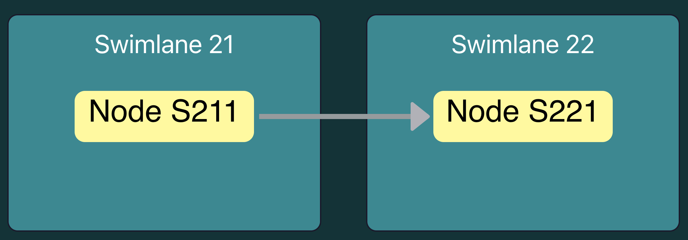
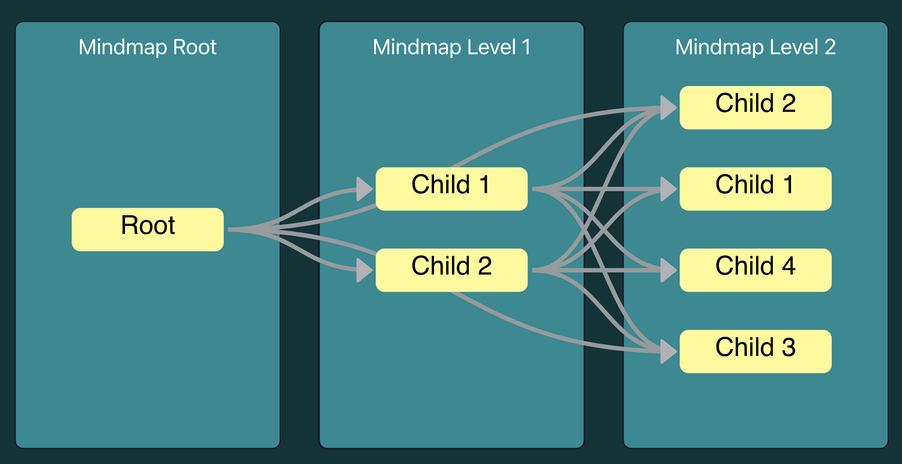
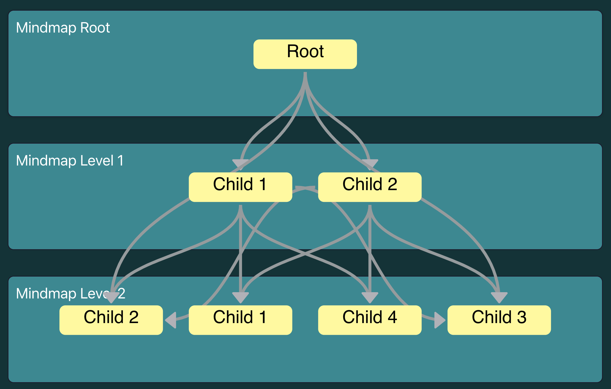

# Project - Implement Swimlane flow chart with `Reactflow`

This is building Swimlane flowchart based on ReactFlow and `Dagre` alogrithm. It contains below features:

- auto layout based on DAG Dagre algorithm.
- auto change edge path if there is intermediate node.
- supports change layout `Top to Bottom` and `Left to Right`

# Start project `npm start`

Runs the app in the development mode.\
Open [http://localhost:3005](http://localhost:3005) to view it in the browser.

The page will reload if you make edits.\
You will also see any lint errors in the console.

# `Data Schema`

```json
{
    "id": "object id",
    "swimlanes": [
        {
            "id": "swimlane obj",
            "layer": 0,  <=swimlane layer order
            "label": "swimlane label, will display in flowchat",
            "nodes": [
                {
                    "id": "nodes id",
                    "name": "node name",
                    "label": "node label, will display in flowchart"
                },
            ],
            "edges": [
                {
                    "id": "edge id",
                    "sourceNodeId": "source node id",
                    "targetNodeId": "target node id"
                }
            ]
        }
    ]
}
```

# Samples

## Simple swimlane

```json
{
  "id": "Sample 2",
  "swimlanes": [
    {
      "id": "S21",
      "layer": 0,
      "label": "Swimlane 21",
      "nodes": [
        {
          "id": "S21-1",
          "name": "Node S211",
          "label": "Node S211",
          "code": "NODES211"
        }
      ]
    },
    {
      "id": "S22",
      "label": "Swimlane 22",
      "layer": 1,
      "nodes": [
        {
          "id": "S22-1",
          "name": "Node S221",
          "label": "Node S221",
          "code": "NODES221"
        }
      ]
    }
  ],
  "edges": [
    {
      "id": "S211-S221",
      "sourceNodeId": "S21-1",
      "targetNodeId": "S22-1"
    }
  ]
}
```



## Swimlane mindmap

```json
{
  "id": "Sample 3",
  "swimlanes": [
    {
      "id": "S3-1",
      "label": "Mindmap Root",
      "layer": 0,
      "nodes": [
        {
          "id": "S3-1-M1",
          "label": "Root",
          "code": "ROOT"
        }
      ]
    },
    {
      "id": "S3-2",
      "label": "Mindmap Level 1",
      "layer": 1,
      "nodes": [
        {
          "id": "S3-2-M1",
          "label": "Child 1",
          "code": "CHILD1"
        },
        {
          "id": "S3-2-M2",
          "label": "Child 2",
          "code": "CHILD2"
        }
      ]
    },
    {
      "id": "S3-3",
      "label": "Mindmap Level 2",
      "layer": 2,
      "nodes": [
        {
          "id": "S3-3-M1",
          "label": "Child 1",
          "code": "CHILD1"
        },
        {
          "id": "S3-3-M2",
          "label": "Child 2",
          "code": "CHILD2"
        },
        {
          "id": "S3-3-M3",
          "label": "Child 3",
          "code": "CHILD4"
        },
        {
          "id": "S3-3-M4",
          "label": "Child 4",
          "code": "CHILD4"
        }
      ]
    }
  ],
  "edges": [
    {
      "id": "E-S3-1-M1-S3-2-M1",
      "sourceNodeId": "S3-1-M1",
      "targetNodeId": "S3-2-M1"
    },
    {
      "id": "E-S3-1-M1-S3-2-M2",
      "sourceNodeId": "S3-1-M1",
      "targetNodeId": "S3-2-M2"
    },
    {
      "id": "E-S3-2-M1-S3-3-M1",
      "sourceNodeId": "S3-2-M1",
      "targetNodeId": "S3-3-M1"
    },
    {
      "id": "E-S3-2-M1-S3-3-M2",
      "sourceNodeId": "S3-2-M1",
      "targetNodeId": "S3-3-M2"
    },
    {
      "id": "E-S3-2-M1-S3-3-M3",
      "sourceNodeId": "S3-2-M1",
      "targetNodeId": "S3-3-M3"
    },
    {
      "id": "E-S3-2-M1-S3-3-M4",
      "sourceNodeId": "S3-2-M1",
      "targetNodeId": "S3-3-M4"
    },
    {
      "id": "E-S3-2-M2-S3-3-M3",
      "sourceNodeId": "S3-2-M2",
      "targetNodeId": "S3-3-M3"
    },
    {
      "id": "E-S3-2-M2-S3-3-M4",
      "sourceNodeId": "S3-2-M2",
      "targetNodeId": "S3-3-M4"
    },
    {
      "id": "E-S3-2-M2-S3-3-M2",
      "sourceNodeId": "S3-2-M2",
      "targetNodeId": "S3-3-M2"
    },
    {
      "id": "E-S3-2-M2-S3-3-M1",
      "sourceNodeId": "S3-2-M2",
      "targetNodeId": "S3-3-M1"
    },
    {
      "id": "E-S3-3-M3-S3-1-M1",
      "targetNodeId": "S3-3-M3",
      "sourceNodeId": "S3-1-M1"
    },
    {
      "id": "E-S3-3-M2-S3-1-M1",
      "targetNodeId": "S3-3-M2",
      "sourceNodeId": "S3-1-M1"
    }
  ]
}
```



